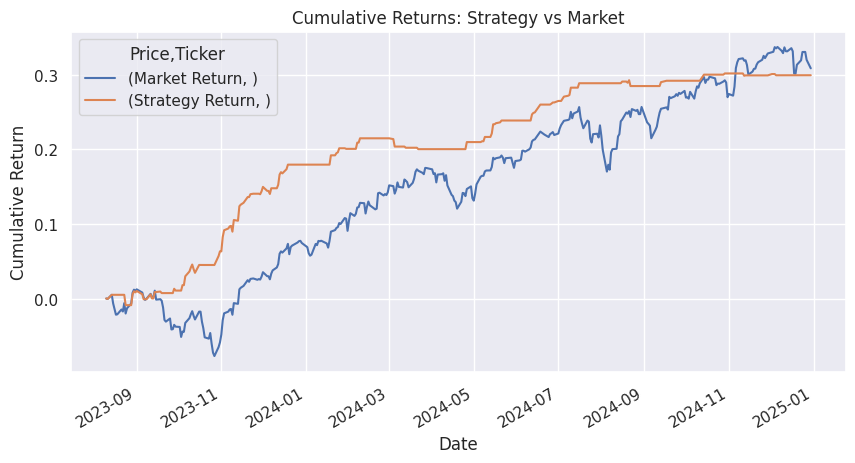

{\rtf1\ansi\ansicpg1252\cocoartf2822
\cocoatextscaling0\cocoaplatform0{\fonttbl\f0\fswiss\fcharset0 Helvetica;}
{\colortbl;\red255\green255\blue255;}
{\*\expandedcolortbl;;}
\margl1440\margr1440\vieww11520\viewh8400\viewkind0
\pard\tx720\tx1440\tx2160\tx2880\tx3600\tx4320\tx5040\tx5760\tx6480\tx7200\tx7920\tx8640\pardirnatural\partightenfactor0

\f0\fs24 \cf0 # \uc0\u55357 \u56520  Stock Price Direction Classifier\
\
A beginner-friendly machine learning project to predict whether the next day's stock return will be positive or negative using technical indicators. Includes strategy backtesting and performance evaluation.\
\
---\
\
## \uc0\u55358 \u56800  Project Summary\
\
We use historical SPY ETF price data (S&P 500) and train two classifiers:\
\
- **Logistic Regression**\
- **Random Forest**\
\
Key features include:\
- 5-day & 10-day **Simple Moving Averages**\
- 10-day **Volatility**\
- 5-day **Momentum**\
\
We evaluate:\
- Model accuracy vs baseline\
- **Confusion matrix**\
- **Sharpe Ratio**\
- Strategy vs Market performance in a **backtest**\
\
---\
\
## \uc0\u55357 \u56522  Results (Example)\
\
\
\
| Metric                 | Strategy | Market |\
|------------------------|----------|--------|\
| Accuracy (RF)          | ~XX%     | --     |\
| Sharpe Ratio           | X.XX     | X.XX   |\
\
---\
\
## \uc0\u55357 \u56510  Files\
\
- `Stock_Price_Classifier_Upgraded.ipynb` \'97 Full notebook (Colab-ready)\
- `random_forest_model.pkl` \'97 Trained model (optional)\
- `README.md` \'97 Project documentation\
\
---\
\
## \uc0\u55357 \u56960  How to Run\
\
1. Clone this repo:\
```bash\
git clone https://github.com/yourusername/stock-price-classifier.git\
}